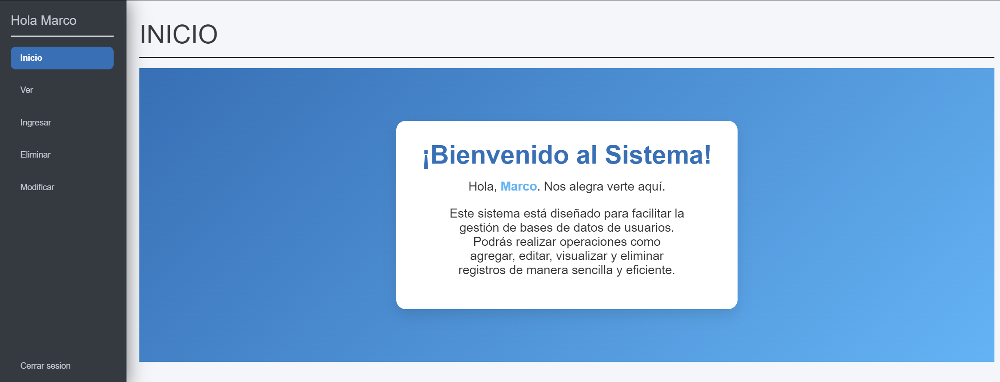

# Proyecto de Página de Inicio de Sesión

Este proyecto consiste en una página de inicio de sesión (login) diseñada con HTML y CSS. Incluye una interfaz estilizada con imágenes decorativas, un formulario para la entrada de usuario y contraseña, y varios elementos visuales como sombras y bordes redondeados para una apariencia moderna.

## Descripción

La página de inicio de sesión tiene un diseño amigable y elegante, ideal para proyectos de aplicaciones web o catálogos en línea. La interfaz incluye:
- Campos de entrada para el nombre de usuario y la contraseña.
- Un checkbox para la opción de "Recordar" usuario.
- Un botón de envío.
- Elementos decorativos, como círculos y sombras, que aportan un toque visual moderno.

## Autores

- [Gianmarco Steve Contreras Coronel](https://github.com/GozuCtrs) - Desarrollador del proyecto


## Captura de Pantalla



## Características

- **Estilo visual**: Fondo con imágenes y sombras, elementos con bordes redondeados, y decoración visual de círculos.
- **Formulario de inicio de sesión**: Incluye campos para el usuario, contraseña, y una casilla de verificación "Recordar".
- **Responsivo**: La estructura y diseño de la página permite un funcionamiento adecuado en diferentes dispositivos.

## Instalación

1. Clona este repositorio:
   ```bash
   git clone https://github.com/GozuCtrs/MC_Contreras_Coronel.git


